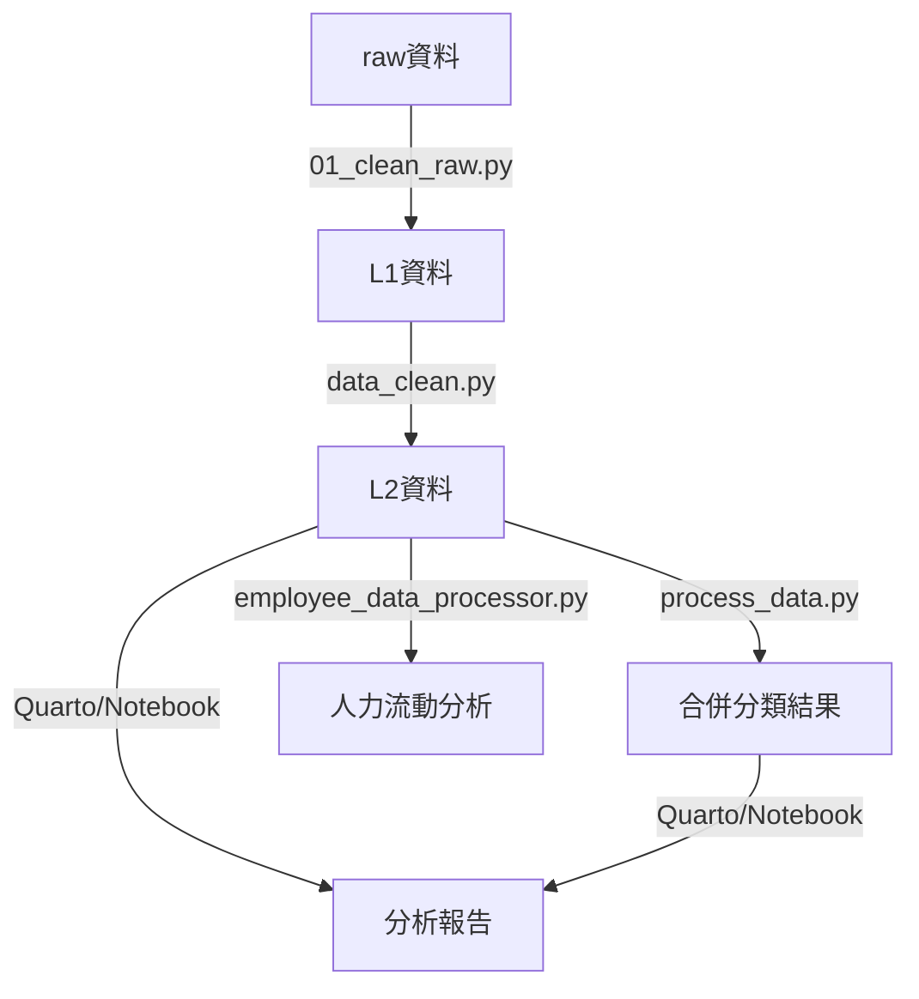

# 公費留考名額分析專案

## 專案簡介

分析台灣公費留學考試相關的名額、錄取、師資結構與就讀領域的變動。

---

## 專案結構與檔案說明

```
Scholarship-Analysis/
├── raw/                # 原始資料（各年度師資、錄取、博士班等）
├── using_data/         # 處理後資料
│   ├── L1/             # 初步清理後的資料
│   ├── L2/             # 進階整合、比對後的資料
│   └── 系所比對/        # 系所/學歷比對用資料
├── src/                # 師資分析程式碼
├── report/             # 分析報告（Quarto、Jupyter、HTML等）
├── README.md           # 專案說明文件
├── pyproject.toml      # Python 專案設定
├── poetry.lock         # Python 套件鎖定檔
└── using_data.dvc      # DVC 資料追蹤設定
```

### 1. 原始資料（raw/）

- **114.01.06-(108.10期-113.10期)-教1-給國際司.xlsx**：108-113學年度一般大學師資資料
- **114.01.06_(國際司)技專校院108至113上表1-1.csv**：108-113技專校院師資資料
- **※100-113公費各學門合格報名及錄取人數-1140106提供國教院.xlsx**：100-113學年度公費生報名與錄取統計
- **博士班代碼/**：博士班相關代碼資料夾

### 2. 處理後資料（using_data/）

#### L1/（初步清理）

- **普大師資.csv**、**科大師資.csv**：由原始師資資料清理而成
- **公費錄取.csv**：由公費生錄取原始資料彙整
- **學門代碼表.csv/xlsx**：學門分類對照表
- **113學年度大專校院系所彙整表(以學院分類).csv**：學校與系所分類資料

#### L2/（進階整合）

- **faculty.csv**：整合後的教師資料（主分析用）
- **合併後的分類結果0529.csv**：學歷、系所比對後的分類結果
- **0113_103~112錄取年_獲公費獎學金者回國相關數據資料V3.xlsx**：公費生回國相關數據

#### 系所比對/

- 存放「獲公費回國相關數據」之國內外學歷、系所比對的中間資料

### 3. 師資分析程式碼（src/）

- **01_clean_raw.py**：原始資料初步清理，產生 L1 層資料
- **data_clean.py**：進行資料型態、欄位標準化、合併代碼表，產生 L2 層資料
- **employee_data_processor.py**：分析教師新進、離開、異動等人力流動情形
- **__init__.py**：模組初始化

### 4. 分析報告（report/）

- **公費生初步分析.qmd/html**：公費生資料分析（Quarto/HTML）
  - 需要先執行 **process_data.py**，進階資料整合與比對（如最高學歷、國外學歷等），產生合併分類結果
- **細學類表格.qmd/細學類表格_技專.qmd**：細學類層級的教師結構與流動分析
- **學門分析_技專.qmd**：技專校院學門層級分析
- **補充表格0207.qmd**：補充統計表格產生
- **領域分析.ipynb/學門分析.ipynb**：Jupyter Notebook 互動式分析
- **public/**：對外發佈用報告（如院長版）

---

## 資料處理與分析流程

1. **原始資料放入 `raw/`**
2. **執行初步清理** `python src/01_clean_raw.py`→ 產生 `using_data/L1/` 內初步清理資料
3. **進階資料整合** `python src/data_clean.py`→ 產生 `using_data/L2/faculty.csv` 等進階資料
4. **進行學歷、系所比對與分類** `process_data.py`→ 產生合併後分類結果
5. **人力流動分析**於報告或 Notebook 中呼叫 `employee_data_processor.py` 相關函式
6. **分析報告產生**
   使用 Quarto (`.qmd`) 或 Jupyter Notebook (`.ipynb`) 進行資料分析與視覺化

---

## 主要檔案關係圖



---

## 環境設定

- Python 3.8 以上
- 主要套件：pandas、numpy、matplotlib、seaborn、jupyter、quarto、dvc（如需資料追蹤）

安裝範例：

```bash
pip install pandas numpy matplotlib seaborn jupyter
```
